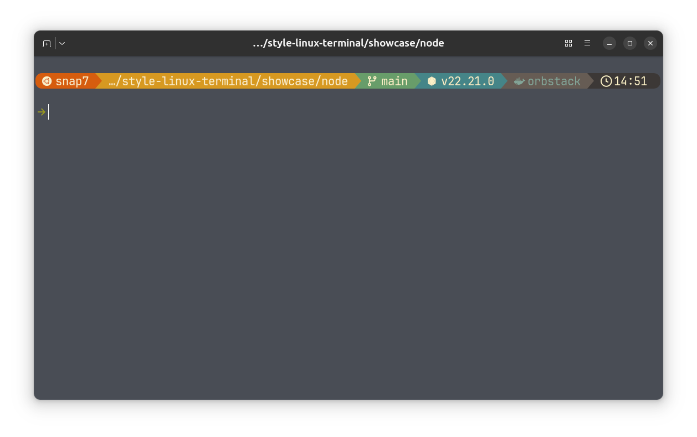

# 🚀 Style Linux Terminal

[](https://github.com/giorgitchanturidze/style-linux-terminal/releases)
[](LICENSE)

> Transform your Linux terminal into a modern, beautiful shell — Zsh, Oh My Zsh, Starship prompt, Autosuggestions, Syntax Highlighting, and an automated setup script.



## ✨ What You Get

- **[Zsh](https://www.zsh.org/)** — powerful shell that replaces Bash
- **[Oh My Zsh](https://ohmyz.sh/)** — plugin framework with 300+ plugins
- **[Starship](https://starship.rs/)** — blazing-fast, cross-shell prompt written in Rust
- **[Autosuggestions](https://github.com/zsh-users/zsh-autosuggestions)** — command suggestions as you type
- **[Syntax Highlighting](https://github.com/zsh-users/zsh-syntax-highlighting)** — colors commands green/red as you type

---

## 📌 Choose Your Path

| | |
|---|---|
| **[⚡ Quick Start](#-quick-start)** | Run one script and you're done. Recommended for most users. |
| **[🛠 Manual Installation](#-manual-installation)** | Step-by-step guide if you want full control. |

---

## 📋 Prerequisites

- A supported distro: Ubuntu/Debian, Fedora, or Arch (and their derivatives)
- `git` and `curl` installed
- `sudo` access (to install packages and change your default shell)

---

## ⚡ Quick Start

```bash
git clone https://github.com/giorgitchanturidze/style-linux-terminal.git
cd style-linux-terminal
chmod +x setup.sh
./setup.sh
```

The script will:
- Detect your distro (Ubuntu/Debian, Fedora, Arch)
- Install Zsh, Oh My Zsh, Starship, and plugins
- Back up your existing configs
- Apply Gruvbox Rainbow preset and configure your shell

After the script finishes, **restart your terminal** or run:

```bash
exec zsh
```

> 💡 The script asks before each step — you can skip anything you don't want.

---

## 🛠 Manual Installation

If you prefer to set things up yourself, follow along below.

### 1. Install Zsh

Zsh is a powerful shell that replaces Bash with better autocompletion, scripting, and plugin support.

**Ubuntu / Debian:**

```bash
sudo apt update && sudo apt install zsh -y
```

**Fedora:**

```bash
sudo dnf install zsh -y
```

**Arch:**

```bash
sudo pacman -S zsh
```

Set Zsh as your default shell:

```bash
chsh -s $(which zsh)
```

Log out and back in (or restart your terminal) for the change to take effect.

> 💡 If `chsh` complains that zsh is not a valid shell, register it first:
> ```bash
> echo "$(which zsh)" | sudo tee -a /etc/shells
> ```

---

### 2. Install Oh My Zsh

Oh My Zsh is a framework that manages your Zsh configuration and gives you access to hundreds of plugins and themes.

```bash
sh -c "$(curl -fsSL https://raw.githubusercontent.com/ohmyzsh/ohmyzsh/master/tools/install.sh)"
```

---

### 3. Install Starship Prompt

Starship is a minimal, fast, and customizable prompt written in Rust. It works with any shell and shows useful info like Git branch, language versions, and command duration.

**Install Starship:**

```bash
curl -sS https://starship.rs/install.sh | sh
```

**Install a Nerd Font** (required for icons):

Download and install [MesloLGS NF](https://github.com/ryanoasis/nerd-fonts/releases/latest) or any [Nerd Font](https://www.nerdfonts.com/font-downloads) you like. Then set it as your terminal's font in your terminal emulator's settings.

**Enable Starship in Zsh:**

In your `~/.zshrc`:

1. Set the Oh My Zsh theme to empty so it doesn't override Starship:

   ```bash
   ZSH_THEME=""
   ```

2. Add the Starship init line at the **very bottom** of the file — it must come **after** `source $ZSH/oh-my-zsh.sh`, otherwise Oh My Zsh will overwrite the prompt:

   ```bash
   eval "$(starship init zsh)"
   ```

**Apply a preset:**

```bash
mkdir -p ~/.config
starship preset gruvbox-rainbow -o ~/.config/starship.toml
```

See [Customization](#-customization) below for other presets.

---

### 4. Install Zsh Plugins

#### Autosuggestions

Suggests commands as you type based on your history. Press `→` (right arrow) to accept.

```bash
git clone https://github.com/zsh-users/zsh-autosuggestions \
  ${ZSH_CUSTOM:-~/.oh-my-zsh/custom}/plugins/zsh-autosuggestions
```

#### Syntax Highlighting

Colors your commands as you type — valid commands turn green, errors turn red.

```bash
git clone https://github.com/zsh-users/zsh-syntax-highlighting \
  ${ZSH_CUSTOM:-~/.oh-my-zsh/custom}/plugins/zsh-syntax-highlighting
```

**Enable both plugins** in `~/.zshrc`:

Find the `plugins=(git)` line and replace it with:

```bash
plugins=(
  git
  zsh-autosuggestions
  zsh-syntax-highlighting
)
```

> ⚠️ Order matters: `zsh-syntax-highlighting` must be the **last** plugin in the list, otherwise it can interfere with widgets defined by other plugins.

---

### 5. Reload & Enjoy

```bash
source ~/.zshrc
```

Or simply restart your terminal. You're done! 🎉

---

## 🔧 Customization

### Change Starship Preset

Browse all presets at [starship.rs/presets](https://starship.rs/presets/):

```bash
starship preset gruvbox-rainbow -o ~/.config/starship.toml
starship preset nerd-font-symbols -o ~/.config/starship.toml
starship preset plain-text-symbols -o ~/.config/starship.toml
```

Or edit `~/.config/starship.toml` directly — the [Starship docs](https://starship.rs/config/) cover every option.

### Change Color Scheme

Your color scheme is set in your terminal emulator, not in the shell. Popular choices:

- [Catppuccin](https://github.com/catppuccin) — pastel colors, easy on the eyes
- [Dracula](https://draculatheme.com/) — dark purple classic
- [Tokyo Night](https://github.com/folke/tokyonight.nvim) — soft dark blue
- [Gruvbox](https://github.com/morhetz/gruvbox) — warm retro tones

Search for your terminal + theme name (e.g., "Catppuccin Ghostty", "Dracula GNOME Terminal") to find install instructions.

---

## ❓ Troubleshooting

### Icons show as squares or question marks

You need a Nerd Font. Download one from [nerdfonts.com](https://www.nerdfonts.com/font-downloads) (MesloLGS NF is a safe choice), install it, and set it as your terminal's font in your terminal emulator's preferences.

### Starship prompt not showing

Make sure `eval "$(starship init zsh)"` is at the **very end** of your `~/.zshrc`, after all other source/eval lines.

### The terminal asks me to configure p10k every time

If you previously had Powerlevel10k installed, remove it:

```bash
rm -rf ${ZSH_CUSTOM:-$HOME/.oh-my-zsh/custom}/themes/powerlevel10k
rm -f ~/.p10k.zsh
```

Then make sure `ZSH_THEME=""` is set in your `~/.zshrc`.

### I want to go back to Bash

```bash
chsh -s $(which bash)
```

Then log out and back in.

---

## 🗑 Uninstall

To remove everything and go back to a clean state:

```bash
# Switch back to bash
chsh -s $(which bash)

# Remove Oh My Zsh (this also removes plugins)
rm -rf ~/.oh-my-zsh

# Remove Starship
sudo rm -f "$(which starship)"
rm -f ~/.config/starship.toml

# Restore your most recent .zshrc backup (if setup.sh created one)
latest=$(ls -t ~/.zshrc.backup.* 2>/dev/null | head -1)
[ -n "$latest" ] && mv "$latest" ~/.zshrc && echo "Restored $latest → ~/.zshrc"
```

---

## ⭐ Support
 
If this helped you, consider giving the repo a star — it helps others find it!
 
Want to support the project? [Buy me a coffee ☕](https://www.paypal.com/paypalme/snap7dev7)
 
Found an issue or have a suggestion? [Open an issue](https://github.com/giorgitchanturidze/style-linux-terminal/issues) or submit a PR.
 
---

## 📜 License

[MIT](LICENSE)
